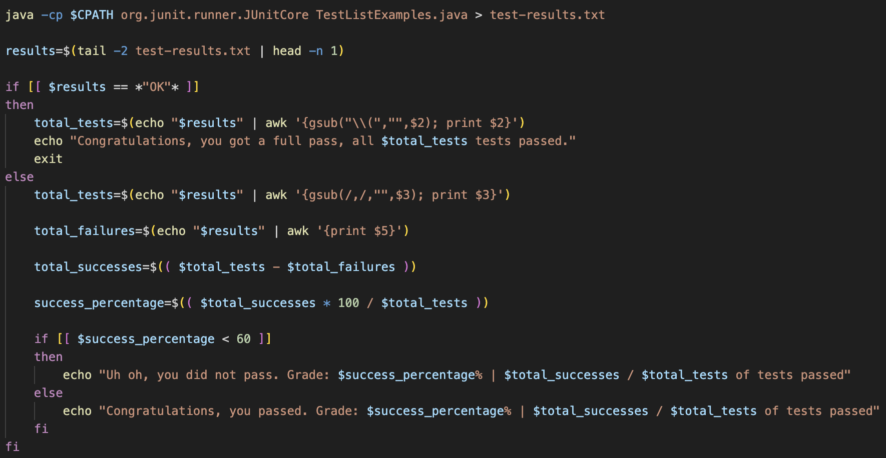
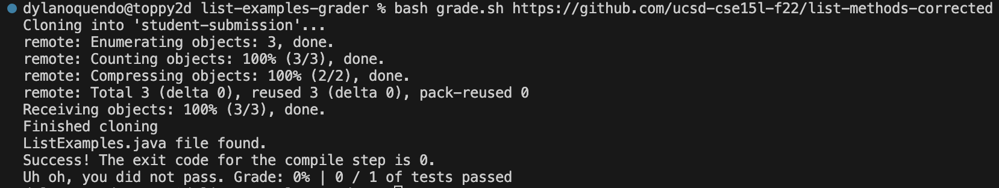
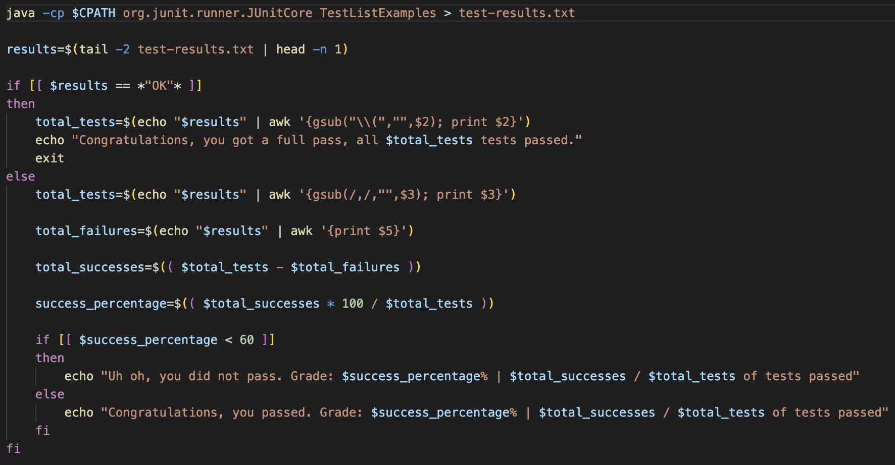
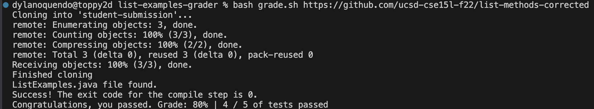

# Debugging
---
  1) Lab 6 Help
     
I am currently having an issue with my grade.sh code in the list-examples-grader repo for lab 6.
     It seems that no matter which student submission I use, the file always fails a single test,
     even though I have way more than just 1 test. The grader can find the ListExamples.java file in
     the given repo just fine, and everything compiles without issue, but then it just says that there
     was a single test that failed. I attached what I see from the terminal and the code block where the
     error must be coming from, but I am at a loss, why does it only say one test, and why is it failing?

      
     ---
  2) Something to Think About
     
Hello, after looking over your problem, I agree that the issue is in your code in the given picture.
     I will direct you to think about where the issue could be if it's after compiling, and assuming the
     given files work as expected if they were to run. This seems to leave only one area left for an error
     such as this to occur. Perhaps you could try properly executing everything manually from the command
     line? Please follow up if you are still stuck/confused.

     
     ---
  3) Fixed
      
     
The issue was that instead of passing an appropriate test class to java  
     when attempting to run the test file, they were instead passing the class with the ".java" extension,  
     or the name of the file instead of the class. This resulted in a failure to run the right class in  
     JUnit, which is why there was a failure of only one test.

     
     ---
  4) Setup
     
The setup was from this repo: https://github.com/DylanO03/grader-review-DylanO03.git  
     which is my personal repo from week 6 lab in which we constucted a ListExamples.java grader bash file  
     I had a pretty throrough implementation of grader, and I chose to add ".java" to the end of the test  
     class in the java run line that passed to test-results.txt. Everything seen in first and third parts  
     are all that is needed to replicate and "fix" this bug, given you use the repo I provided. What seemed  
     tricky about this bug is that it's easy to miss as it isn't blatently wrong, and the way it appears  
     is without a true error, just misbehavior.

     ---
     ---
# Reflection
---
  I didn't even know what a bash file was before we covered it, and using it to run command line arguments  
  in a neat package is cool. And two things that I think are really cool, I learned today in section, where  
  we can actually debug in gui in VScode, which seems so much better than jdb, and being able to add copilot  
  ai to help with coding within my files seems incredibly helpful.
